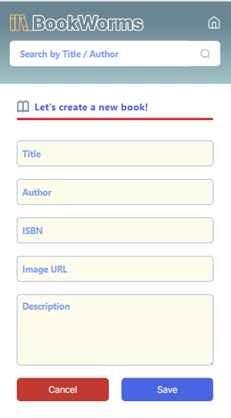
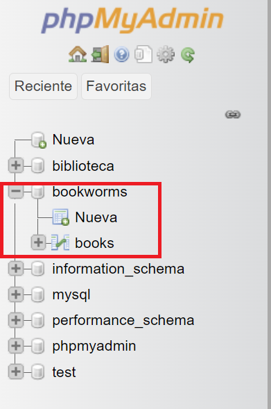
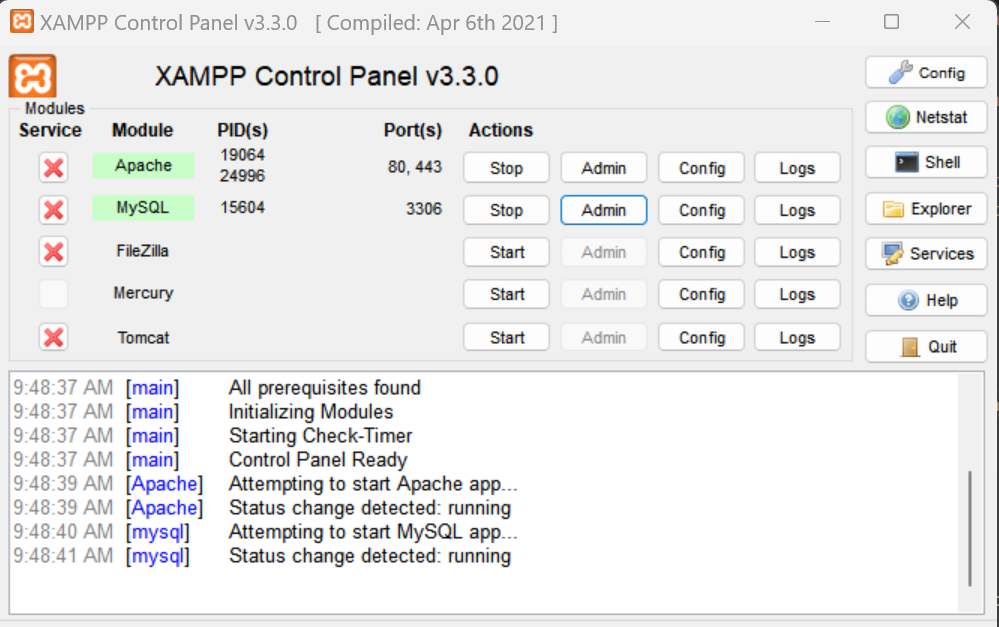
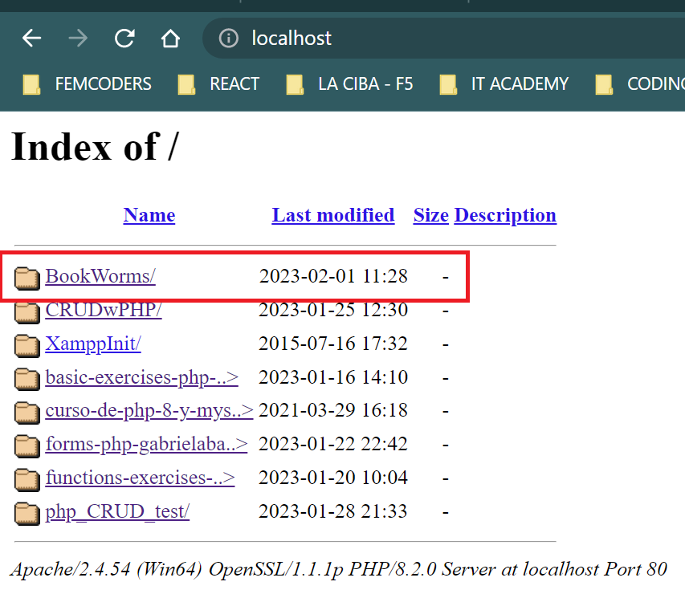

# BookWorms

:closed_book: Library (Biblioteca) project for FemCoders promotion. CRUD PHP project using MySql database.

## Table of contents

1. [Description of the project](#Description-of-the-project)
2. [Characteristics and screenshots of the project](#Characteristics)
3. [Access to the project](#Access)
4. [Tools used](#Tools-used)
5. [Authors](#Authors)

## Description of the project
***
Using PHP as a backend language and MySql as a database, we applied CRUD (Create, Read, Update and Delete). Our database has a table with six fields for each register (book):
* ID
* Title
* Author (authors)
* ISBN
* Cover image
* Description
## Characteristics and screenshots of the project
***
#### Display all books.

#### Create a book.

#### Delete a  book. 

#### Update a book. 

## Access to the project
***
The steps to have acces to the project are:
1. Have SQL database called Bookworms with a table named Books.

2. Have Xampp or Mamp intalled and have Apache and MySql turned on.

3. Go to localhost in the navigator (Chrome recomended) and select the folder where the project is dowloaded (Bookworms folder).

4. The main page is displayed.

## Demo
***

## Authors
***
####  Cristina - Developer Rockstar
* https://github.com/Crisktina
#### Gabriela - Scrum Master
* https://github.com/gabrielabarajas
#### Po - Developer Rockstar
* https://github.com/pohengchan
#### Shima - Product Owner
* https://github.com/Archima20